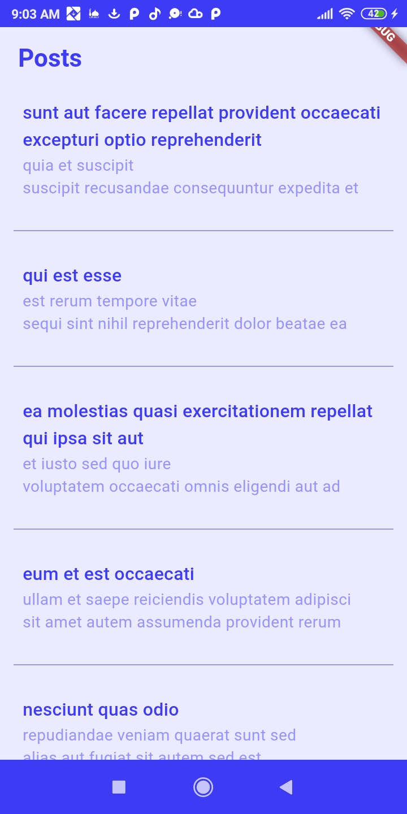
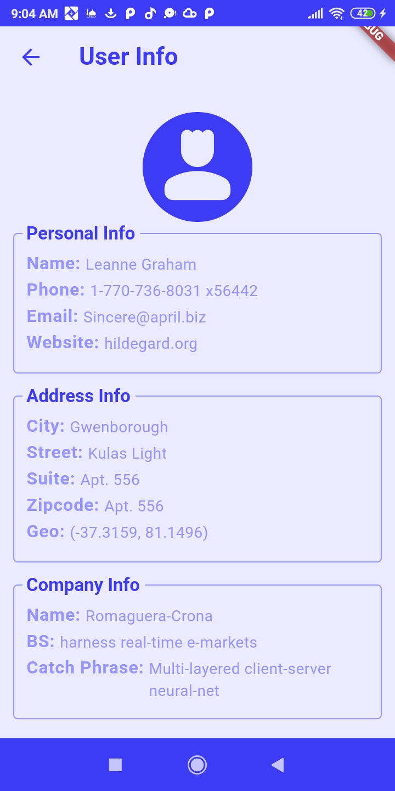

# Clean Architecture
**Clean architecture** is a system blueprint that separates the application into layers. This simplifies the app’s programming and makes its maintenance easier in the future, allowing for future extensions. It also makes the app's components reusable. This makes the app readable, scalable, and testable.

## Clean architecture layers
We have three layers:
+ Domain
+ Data
+ Presentation

We can also have two additional layers to support: resources, shared_library.

### Presentation
This layer contains the app’s contents, such as events and states. It consists of three parts:
+ Pages
+ State Management
+ Widgets

### Domain
This is the innermost layer and does not depend on any other layer. It consists of:
+ Entities
+ Repository Interfaces
+ Use cases

This layer is written in Dart without any Flutter-specific elements, as it focuses on business logic, not implementation details. Repository interfaces are abstract classes or contracts. Use cases, such as sign-up or login, act as a bridge between the layers.

### Data
This is part of the outermost layer and is responsible for data retrieval, such as API calls to a server or accessing a local database. The data layer consists of three parts:
+ Repositories: These implement the repositories from the domain layer. They manage data from different data sources.
+ Data Sources: Includes local and remote sources.
+ Models: Contains the JSON models.

## 📁 Folder structure
The first step is to create a **features** folder next to the main folder. Each feature should go into this folder.

For example, for the **auth** feature, create a folder inside features. Inside the **auth** folder, create three subfolders: **domain**, **presentation**, and **data** (since, as mentioned, the application is divided into these three layers). Each feature will have these three layers.

Inside the **presentation** folder, you will place its three parts as subfolders: 
+ pages
+ state management (call it bloc or the name of the state management you use)
+ widgets

For the **domain** folder, you'll have:
+ usecases
+ entities
+ repositories

For the **data** folder, you'll have:
+ repositories
+ datasources
+ models

## Additional Folders
We might also have other folders directly under lib, such as:

+ config: Place configuration-related files here, such as theme and routes. So, create two folders inside: **theme**, **routes**.
+ core: This folder contains any shared resources across features, such as network or shared use cases. Create two subfolders here: **utils**, **usecases**.

## 💻 Example: Posts App
<p align=center>  </p>

**Posts App** is a simple app that displays a collection of posts with the ability to edit, delete, and add new posts. The API used is [JSONPlaceholder - Free Fake REST API](https://jsonplaceholder.typicode.com/).
I also added a feature in the app to display the publisher's data, which is used to experience a shared use case between the features.

### 📂 Folder Structure
```
lib
├───config
│   ├───routes
│   └───themes
├───core
│   ├───errors
│   ├───network
│   ├───strings
│   ├───usecases
│   ├───utils
│   └───widgets
└───features
    ├───posts
    │   ├───data
    │   │   ├───datasources
    │   │   ├───models
    │   │   └───repositories
    │   ├───domain
    │   │   ├───entities
    │   │   ├───repository
    │   │   └───usecases
    │   └───presentation
    │       ├───bloc
    │       │   ├───posts
    │       │   └───single_post
    │       ├───pages
    │       └───widgets
    └───users
        ├───data
        │   ├───datasources
        │   ├───models
        │   └───repositories
        ├───domain
        │   ├───entities
        │   └───repositories
        └───presentation
            ├───bloc
            ├───pages
            └───widgets
```
### Dependencies
```yaml
dependencies:
  flutter:
    sdk: flutter

  cupertino_icons: ^1.0.8
  dartz: ^0.10.1
  dio: ^5.7.0
  internet_connection_checker: ^3.0.1
  shared_preferences: ^2.3.4    # I used it for simplicity.
  flutter_bloc: ^8.1.6
  get_it: ^8.0.3
```

<h3 align=center> وصلى الله وسلم وبارك على نبينا محمد وعلى آله وصحبه أجمعين</h3>